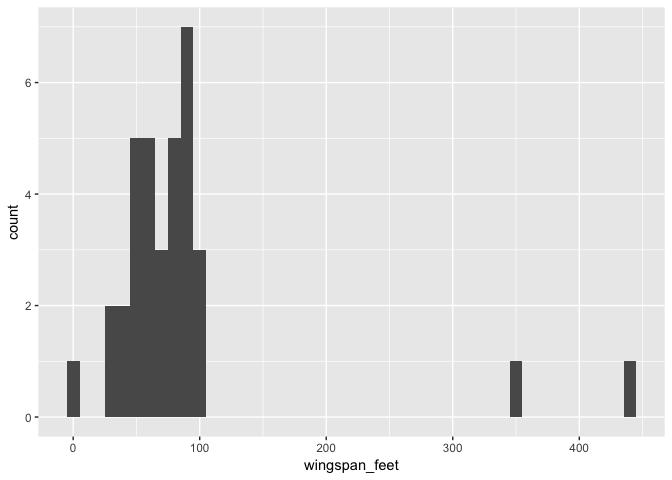
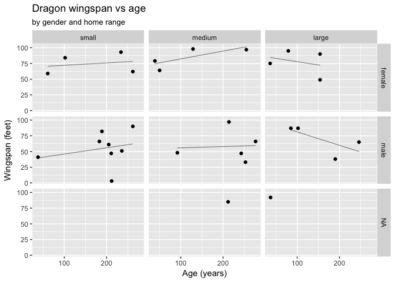

# Import tidy and explore dragon data
Ian Handel  
19/10/2017  


# Import and tidy


```r
dat <- readxl::read_excel("../data/DragonSurvey.xlsx", sheet = "Very Raw Data") %>%
  
  data.table::setnames(str_to_lower(names(.))) %>% 
  
  dplyr::filter(!is.na(dragon)) %>%
  
  mutate(id = paste0("D", str_pad(1:n(), width = 3, pad = "0"))) %>% 
  
  dplyr::rename(home_range = `home range`,
                dragon_age = `dragon age`,
                n_princesses_captured = `n princess captured`,
                question = `answer to question 'what do you do with princesses?\"`,
                gold_affinity_score = `gold affinity score`,
                colour_markings = `colour and markings`) %>% 
  
  fill(interviewer) %>% 
  
  separate(colour_markings, c("colour", "marking")) %>% 
  
  mutate(gender = case_when(gender == "F" ~ "female",
                            gender == "M" ~ "male",
                            gender == "Unknown" ~ NA_character_,
                            TRUE ~ gender),
         gender = factor(gender),
         
         wingspan_feet = case_when(grepl("yard", wingspan) ~ parse_number(wingspan) * 3,
                              grepl("inches", wingspan) ~ parse_number(wingspan) / 12,
                              TRUE ~ parse_number(wingspan)),
         wingspan_feet = round(wingspan_feet),
         
         home_range = str_to_lower(home_range),
         home_range = ordered(home_range, levels = c("small", "medium", "large")),
         
         gold_affinity_score = str_to_lower(gold_affinity_score),
         gold_affinity_score = ordered(gold_affinity_score,
                                       levels = c("none", "very low", "low",
                                                  "neither low or high",
                                                  "high", "very high")),
         
         n_princesses_captured = parse_number(n_princesses_captured, na = "*"),
         
         question = str_to_lower(question),
         question_coded = case_when(grepl("(eat|roast)", question) ~ "eat",
                                    grepl("(ransom|sell|pay)", question) ~ "ransom",
                                    grepl("rescue",question) ~ "rescue",
                                    TRUE ~ "other"),
         question_coded = fct_relevel(question_coded, "other", after = 3)) %>% 
  
  select(id, everything(), -dragon, -wingspan) %>% 
  
  arrange(id, dragon_age)


skimr::skim(dat)
```

```
## Numeric Variables
## # A tibble: 3 x 13
##                     var    type missing complete     n      mean        sd
##                   <chr>   <chr>   <dbl>    <dbl> <dbl>     <dbl>     <dbl>
## 1            dragon_age numeric       0       35    35 164.80000 77.771082
## 2 n_princesses_captured numeric       2       33    35  12.15152  7.124435
## 3         wingspan_feet numeric       0       35    35  86.48571 80.652622
## # ... with 6 more variables: min <dbl>, `25% quantile` <dbl>,
## #   median <dbl>, `75% quantile` <dbl>, max <dbl>, hist <chr>
## 
## Character Variables
## # A tibble: 5 x 9
##           var      type complete missing empty     n   min   max n_unique
## *       <chr>     <chr>    <dbl>   <dbl> <dbl> <dbl> <dbl> <dbl>    <dbl>
## 1      colour character       35       0     0    35     4     6        8
## 2          id character       35       0     0    35     4     4       35
## 3 interviewer character       35       0     0    35     2     6        7
## 4     marking character       35       0     0    35     5     8        5
## 5    question character       35       0     0    35     3   152       30
## 
## Factor Variables
## # A tibble: 4 x 7
##                   var   type complete missing     n n_unique
##                 <chr>  <chr>    <dbl>   <dbl> <dbl>    <dbl>
## 1              gender factor       33       2    35        2
## 2 gold_affinity_score factor       35       0    35        6
## 3          home_range factor       35       0    35        3
## 4      question_coded factor       35       0    35        4
## # ... with 1 more variables: stat <chr>
```

# Check for outlying observations


```r
gg <- ggplot(dat, aes(wingspan_feet)) +
  geom_histogram()

print(gg)
```

```
## `stat_bin()` using `bins = 30`. Pick better value with `binwidth`.
```

<!-- -->

```r
dat <- dat %>%
  mutate(wingspan_feet = case_when(wingspan_feet > 300 ~ NA_real_,
                                 TRUE ~ wingspan_feet))

gg <- ggplot(dat, aes(dragon_age)) +
  geom_histogram()

print(gg)
```

```
## `stat_bin()` using `bins = 30`. Pick better value with `binwidth`.
```

<!-- -->

```r
gg <- ggplot(dat, aes(n_princesses_captured)) +
  geom_histogram()

print(gg)
```

```
## `stat_bin()` using `bins = 30`. Pick better value with `binwidth`.
```

```
## Warning: Removed 2 rows containing non-finite values (stat_bin).
```

<!-- -->

# Exclude non-consentors


```r
non_consentors = c("D004", "D009") # This could be from a file

dat <- dat %>%
  dplyr::filter(!id %in% non_consentors)
```

# Explore data

Visualise relationships between dragon age, wingspan, home range, gender, princesses captured, gold affinity socre and princess outcomes.


```r
gg <- ggplot(dat, aes(dragon_age, wingspan_feet)) +
  geom_point()

print(gg)
```

```
## Warning: Removed 2 rows containing missing values (geom_point).
```

<!-- -->

```r
gg <- gg +
  facet_wrap(~ gender)

print(gg)
```

```
## Warning: Removed 2 rows containing missing values (geom_point).
```

<!-- -->

```r
gg <- gg +
  facet_wrap(~ home_range)

print(gg)
```

```
## Warning: Removed 2 rows containing missing values (geom_point).
```

<!-- -->

```r
gg <- ggplot(dat, aes(dragon_age, n_princesses_captured)) +
  geom_point()

print(gg)
```

```
## Warning: Removed 2 rows containing missing values (geom_point).
```

<!-- -->

```r
gg <- gg +
  facet_wrap(~ gender)

print(gg)
```

```
## Warning: Removed 2 rows containing missing values (geom_point).
```

<!-- -->

```r
gg <- gg +
  facet_wrap(~ home_range)

print(gg)
```

```
## Warning: Removed 2 rows containing missing values (geom_point).
```

<!-- -->


