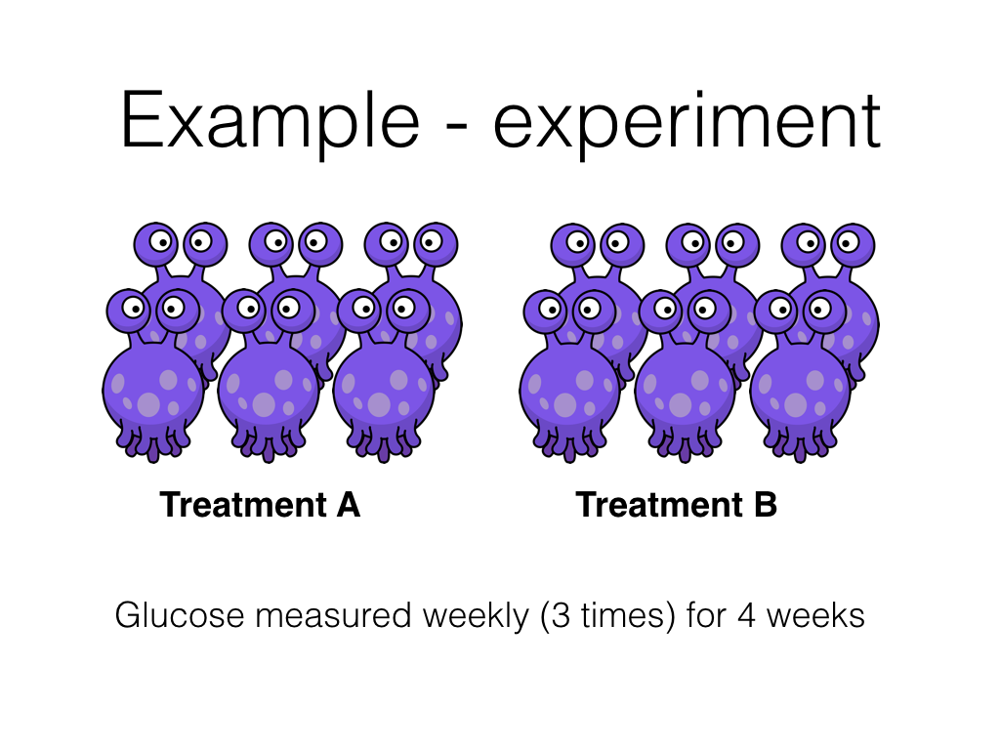

```{r setup2, include=FALSE}
library(tidyverse)
library(knitr)
library(kableExtra) 
library(lme4)

knitr::opts_chunk$set(comment = "", message = FALSE, echo = TRUE)
options(width = 80)
```

## Data cleaning

```{r child="tidy_ih-trial_script_20171020.Rmd"}
```


## Introduction 
Here we can write some words about the background...

## Methods

```{r}

```

Here I can write some more words about these hypoglycaemic aliens...

## Results

```{r load_tidy_data}
dat <- read_csv("../data/ih-trial_results_20171020_tidy.csv")
```

### Characteristics of treatment groups
```{r}
dat %>%
  select(subject, treatment, age) %>%
  distinct() %>%
  group_by(treatment) %>% 
  summarise(n = sum(!is.na(age)),
            mean = mean(age),
            median = median(age),
            sd = sd(age),
            min = min(age),
            max = max(age)) %>% 
  ungroup() %>% 
  map_if(is_bare_double, ~round(.x, 2)) %>% 
  as_tibble() %>% 
  kable(caption = "Age by treatment group",
        table.attr = "style='width:30%;'") %>% 
  kable_styling(bootstrap_options = "bordered", full_width = FALSE)
```


```{r}
dat_sex <- dat %>%
  select(subject, sex, treatment) %>% 
  distinct() %>% 
  group_by(treatment) %>% 
  summarise(male = 100 * mean(sex == "male"),
            n = sum(sex == "male"),
            N = sum(!is.na(sex))) %>% 
  ungroup() %>% 
  map_if(is_bare_double, ~round(.x)) %>% 
  as_tibble()
```

In the study `r filter(dat_sex, treatment == "A")$n` male aliens received treatment __A__ and `r filter(dat_sex, treatment == "B")$n` male aliens received treatment __B__. The experiment ran for `r max(dat$week)` weeks and each week the experiment was repeated `r max(dat$rep)` times. There were `r sum(is.na(dat$glucose))` missing glucose measurements. _The results in this paragraph are generated from the data set - so numbers will update with new data_.


### Plot individual animal results

```{r}

ggplot(dat) +
  aes(week, glucose, group = paste(subject, rep), colour = treatment) +
  geom_point() +
  geom_line(alpha = 0.25) +
  stat_summary(fun.data = "mean_cl_boot",
               geom = "pointrange",
               size = 0.5,
               fatten = 0.2,
               colour = "black",
               group = 1) +
  facet_grid(sex ~ treatment) +
  theme_bw() +
  guides(colour = FALSE) +
  labs(title = "Value vs time by treatment and sex",
       subtitle = "Response greater in A than B?",
       x = "Week",
       y = "glucose (mg/L)")


```


### Statistical model

```{r, message=FALSE, warning=FALSE}
mod <- lmer(glucose ~ treatment * week + age + sex + (1 | subject), data = dat)
sjPlot::sjt.lmer(mod, digits.std = 3)$data %>% 
  as_tibble() %>%
  select(coef.name:std.se1) %>% 
  kable(type = "text")
```


