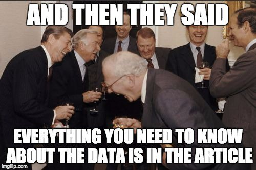

```{r, echo = FALSE, include = FALSE}
library(knitr)
knitr::opts_chunk$set(echo = TRUE, comment = "")
```


## What am I going to talk about?

```{r, echo = FALSE}

```


## Excel
>- Is easy
>- Is fairly quick (the first time)
>- Isn't free but it might be cheap
>- Is difficult to make 'reproducible'

## R
>- Isn't easy (but you can learn it)
>- Is very quick the 2nd & 3rd & 4th & 5th... times
>- Is free
>- Is easy to make 'reproducible'
